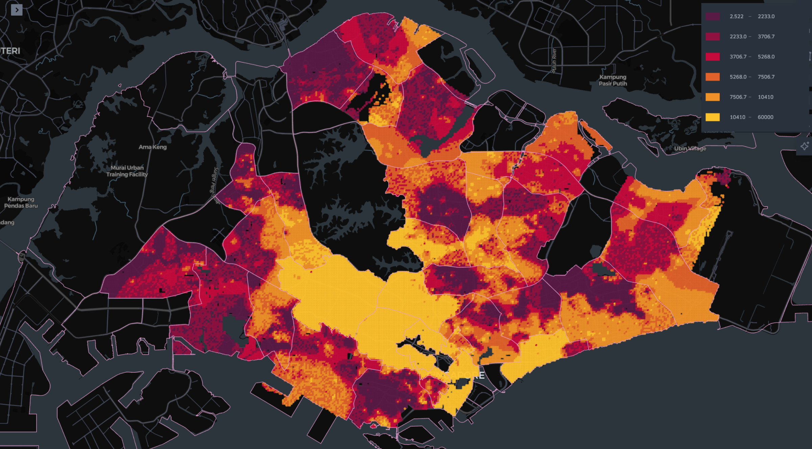

# Generating Synthetic Income Data for Singapore

## **Overview**
This project generates ~40,000 income data points for Singapore on a 100mx100m geospatial grid using:
- **Public /private property prices** (obtained from data.gov.sg, URA) as a proxy for income
- **Income data aggregated by planning area** (obtained from the Department of Statistics) for broad planning area income distributions
- **Population density 100mx100m** (obtained from WorldPop) for generation of 100mx100m grid and removal of non-residential interpolated points

*Visualization of estimated income distribution based on property prices over a 100m x 100m grid for Singapore.*
<!-- 
*Figure 2: Visualization of mean property price per square meter from HDB and private properties in Singapore.* -->

---

## **Datasets**
### **1. Income Data (`income.csv`)**
Contains income distributions at the planning area level. Each planning area has total households and counts in income brackets.

**Example:**
| Planning Area  | Total   | No Working Person | Below $1,000 | $1,000–$1,999 | $2,000–$2,999 | ... | $20,000 & Over |
|----------------|---------|-------------------|--------------|---------------|---------------|-----|----------------|
| Total          | 1,225.3 | 118.8            | 24.0         | 70.0          | 70.6          | ... | 148.6          |
| Ang Mo Kio     | 62.6    | 8.7              | 2.1          | 5.4           | 4.4           | ... | 6.1            |

---

### **2. Population Density Data (`population_density.csv`)**
High-resolution dataset (~70,000 rows) containing latitude/longitude and associated population density.

**Example:**
| Lat      | Lon      | Population Density |
|----------|----------|--------------------|
| 1.3521   | 103.8198 | 500                |
| 1.2951   | 103.8541 | 200                |

---

### **3. Property Prices Data**
Contains property price information, housing types, and lat/lon values.

**Example:**
| full_address         | median_price_per_sqm | mean_price_per_sqm | housing_type | latitude     | longitude     |
|----------------------|-----------------------|---------------------|--------------|--------------|---------------|
| 1 BEACH RD           | 5190.35              | 5388.66            | public       | 1.2951       | 103.8541      |
| 1 BEDOK STH AVE 1    | 5254.24              | 5331.65            | public       | 1.3209       | 103.9337      |
| 1 DELTA AVE          | 7310.92              | 7280.62            | public       | 1.2921       | 103.8286      |

---

### **GeoJSON Files**
Polygons defining the boundaries of **planning areas** and **subzones** in Singapore.

---

## **Process**

### **Step 1: Spatially Join Lat/Lon to Planning Areas and Subzones**
1. **Input**:
   - `hdb_property_prices.csv`, `private_property_prices.csv`, and `population_density.csv`.
   - GeoJSON files for planning areas and subzones.

2. **Action**:
   - Perform a spatial join to assign each lat/lon point to a planning area and subzone by checking if it falls within the corresponding polygon.

3. **Output**:
   - For `property_prices.csv`:
     | latitude        | longitude          | median_price_per_sqm | mean_price_per_sqm | housing_type | Planning Area  | Subzone       |
     |------------|--------------|----------------------|---------------------|--------------|----------------|---------------|
     | 1.295097   | 103.854068   | 5190.35             | 5388.66            | public       | DOWNTOWN CORE  | CITY HALL     |
     | 1.320852   | 103.933721   | 5254.24             | 5331.65            | public       | BEDOK          | BEDOK SOUTH   |
     | 1.327969   | 103.922716   | 4165.41             | 4282.90            | public       | BEDOK          | KEMBANGAN     |

   - For `population_density.csv`:
     | latitude      | longitude      | Population Density | Planning Area  | Subzone       |
     |----------|----------|--------------------|----------------|---------------|
     | 1.3521   | 103.8198 | 500                | Bishan         | Marymount     |

---

### **Step 2: Extract cumulative Income Distributions by Planning Area**
1. **Input**:
   - `income.csv` (income bracket counts at the planning area level).

2. **Action**:
   - For each planning area:
     - Normalize income bracket counts to calculate cumulative probability distributions across income brackets.
     - Example table for cumulative probabilities:
       | Planning Area  | 0–$1,000 | $1,000–$1,999 | $2,000–$2,999 | $3,000–$3,999 | ... | $20,000 and Over |
       |----------------|-----------|---------------|---------------|---------------|-----|-------------------|
       | Ang Mo Kio     | 0.0       | 0.1165        | 0.1737        | 0.2313        | ... | 1.0               |

3. **Output**:
   - Cumulative income probability distributions for each planning area. 

---

### **Step 3: Interpolate Property Prices**
1. **Input**:
   - Property prices from Step 1.
   - WorldPop's Singapore population density dataset on a 100mx100m grid.
   - Spatially joined property price data from Step 1.

2. **Action**:
   - For each planning area:
     - Interpolate property prices onto the 100mx100m population density grid using **Inverse Distance Weighting (IDW)** with the 30 nearest neighbors.
     - Combine property prices and population density for each grid cell.

3. **Output**:
   - Interpolated dataset including latitude, longitude, population density, planning area, subzone, and combined interpolated property price:
     | latitude          | longitude         | popDensity | planning_area | subzone       | combined_price       |
     |-------------------|-------------------|------------|---------------|---------------|----------------------|
     | 1.4700001956757494 | 103.80666626685638 | 68.958855  | SEMBAWANG     | SENOKO NORTH  | 4204.512752593874    |
     | 1.4700001956757494 | 103.80749960018618 | 69.520256  | SEMBAWANG     | SENOKO NORTH  | 4199.010361248807    |
     | 1.4700001956757494 | 103.80833293351596 | 77.01106   | SEMBAWANG     | SENOKO NORTH  | 4198.972551019158    |
     | 1.4700001956757494 | 103.80916626684576 | 76.935555  | SEMBAWANG     | SENOKO NORTH  | 4198.752810573111    |

---

### **Step 4: Stratify Property Prices and Assign Income Brackets**
1. **Input**:
   - Interpolated property prices and grid data from Step 3.
   - Income distributions from Step 2.

2. **Action**:
   - Stratify the interpolated property prices into **exponential deciles** to better capture the variability in property values across the planning area.
   - Assign each decile to a corresponding income bracket based on the income distribution of the planning area.
   - Remove subzones that are likely to be non-residential by excluding grid cells with low population density or identified as non-residential zones.

3. **Output**:
   - Final dataset with planning area, subzone, grid latitude/longitude, property price, price decile, income bracket, population density, and average income:
     | planning_area | subzone       | latitude          | longitude         | property_price       | price_decile | income_bracket | popDensity | average_income       |
     |---------------|---------------|-------------------|-------------------|----------------------|--------------|----------------|------------|---------------------|
     | SEMBAWANG     | SENOKO NORTH  | 1.4700001956757494 | 103.80666626685638 | 4204.512752593874    | 0            | 2000_2999      | 68.958855  | 2656.0776596962532  |
     | SEMBAWANG     | SENOKO NORTH  | 1.4700001956757494 | 103.80749960018618 | 4199.010361248807    | 0            | 2000_2999      | 69.520256  | 2166.090143105685   |
     | SEMBAWANG     | SENOKO NORTH  | 1.4700001956757494 | 103.80833293351596 | 4198.972551019158    | 0            | 2000_2999      | 77.01106   | 2354.7126467157277  |
     | SEMBAWANG     | SENOKO NORTH  | 1.4700001956757494 | 103.80916626684576 | 4198.752810573111    | 0            | 2000_2999      | 76.935555  | 2635.9373489898626  |

---